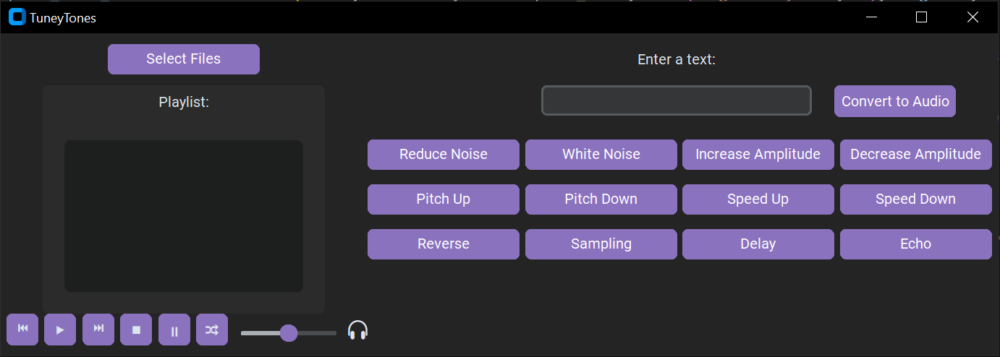

<!DOCTYPE html>
<html>
<body>
  <h1>Welcome to my music player TuneyTones</h1>
    
  <h2>The functions in TuneyTones</h2>
  <ul>
    <li>Stop</li>
    <li>Resume</li>
    <li>Set Volume</li>
    <li>Select Files</li>
    <li>Next Song</li>
    <li>Previous Song</li>
    <li>Shuffle Playlist</li>
    <li>Speed Up</li>
    <li>Speed Down</li>
    <li>Pitch Up</li>
    <li>Pitch Down</li>
    <li>Increase Amplitude</li>
    <li>Decrease Amplitude</li>
    <li>Add White Noise</li>
    <li>Noise Reduction</li>
    <li>Echo</li>
    <li>Reverse Audio</li>
    <li>Text to Speech</li>
    <li>Add Sampling</li>
  </ul>
  <h2>The module used</h2>
  <ul>
    <li>tkinter</li>
    <li>filedialog from tkinter</li>
    <li>gTTS from gtts</li>
    <li>pygame.mixer</li>
    <li>os</li>
    <li>librosa</li>
    <li>random</li>
    <li>customtkinter</li>
    <li>numpy</li>
    <li>pydub</li>
    <li>matplotlib.pyplot</li>
    <li>soundfile</li>
    <li>time</li>
    <li>scipy.signal</li>
  </ul>

